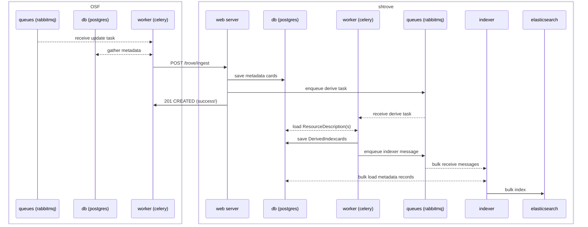
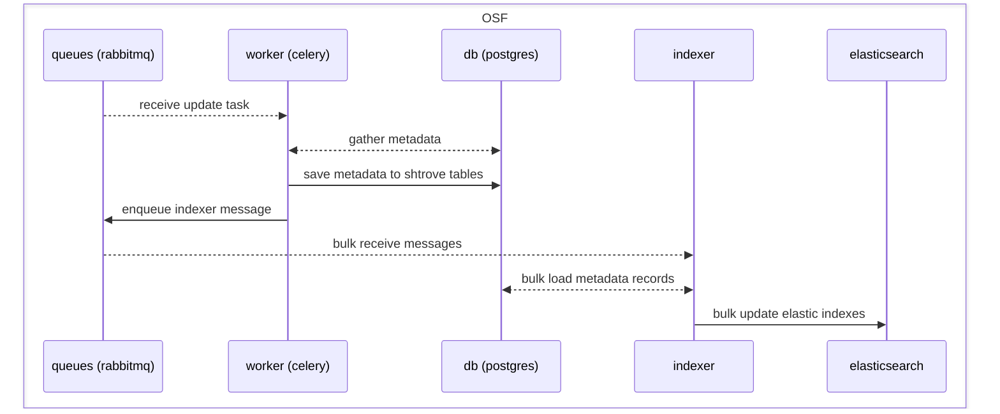
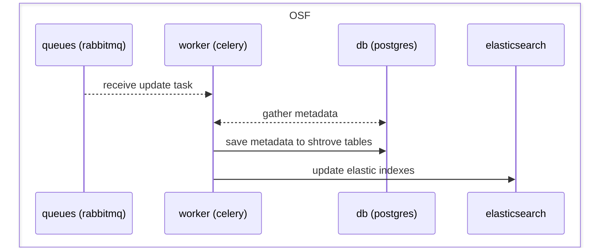

# how this could relate to osf.io

## current state (with SHARE/trove as separate service)
(see [share doc](https://github.com/CenterForOpenScience/SHARE/blob/53de80c1a4831009db052b0517b90584e548f1d3/how-to/relate-to-osf.md#osf-thru-shtrove-ingestion-sequence))

## hypotheticals of django-shtrove in osf.io
if using django-shtrove in osf.io, need to decide whether to keep the bulk indexer daemon from SHARE/trove

benefits of bulk indexing (hypothetical a):
- less contention with other background tasks over workers/queues
- faster/cheaper indexing of many records in a row, with fewer database queries

benefits of no bulk indexing (hypothetical b):
- one less daemon process running in the background
- somewhat simpler code and diagrams

same either way:
- how records are saved/persisted in the database
- how searches are run

### hypothetical a: django-shtrove in osf.io, still with bulk indexer

### hypothetical b: install django-shtrove in osf.io, without bulk indexer

