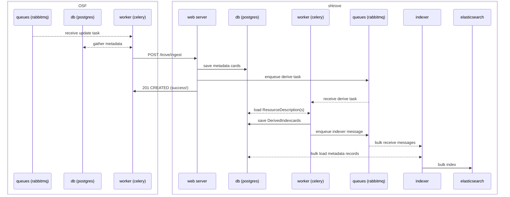
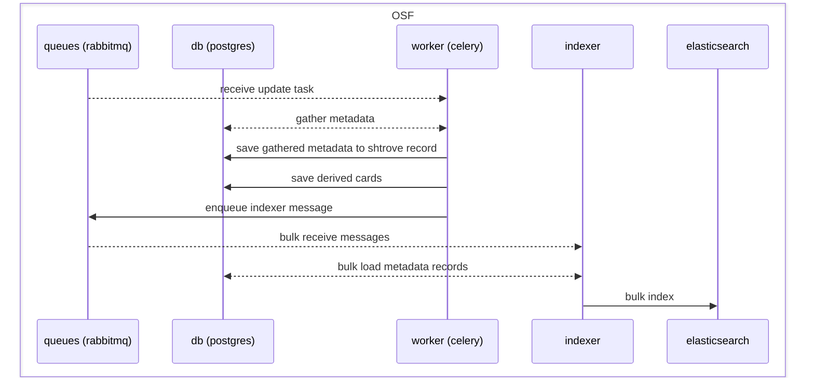
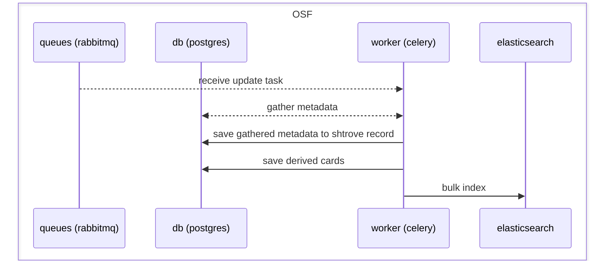

# how this could relate to osf.io

## current state (with SHARE/trove as separate service)
(see [share doc](https://github.com/CenterForOpenScience/SHARE/blob/53de80c1a4831009db052b0517b90584e548f1d3/how-to/relate-to-osf.md#osf-thru-shtrove-ingestion-sequence))

## hypothetical a: install django-shtrove in osf.io, still with bulk indexer

benefits:
- less contention with other tasks over celery workers/queues
- faster/cheaper indexing of many records in a row, with fewer database queries

costs:
- some code complexity
- additional daemon process always running

## hypothetical b: install django-shtrove in osf.io, without bulk indexer

benefits:
- simpler diagram, less code

costs:
- more contention with other tasks over celery workers/queues
- slower/costlier indexing of many records at once
