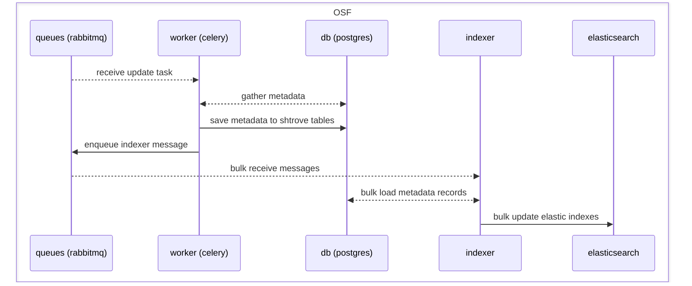
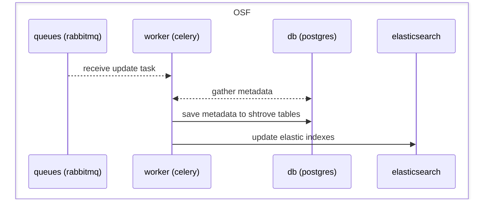
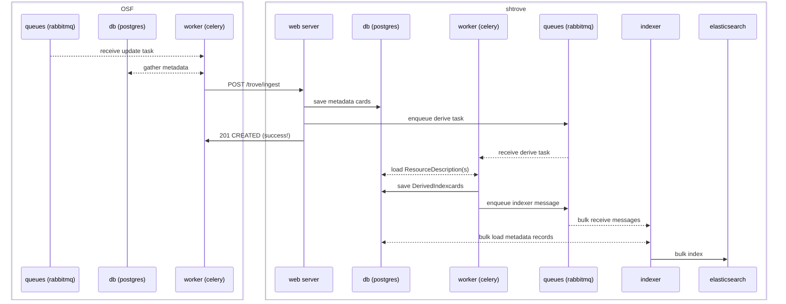

# would django-shtrove in OSF.io make anything simpler?
(wip)

## simpler database
database tables in SHARE that would be dropped if reusable ingest/search bits moved to
django-shtrove and reused in OSF
(pulling from the [shtrove data inventory](https://gist.github.com/aaxelb/77ec7d8140aa6a021abe83221a48df56)):
- droppable from SHARE
  - share_celerytaskresult
  - share_featureflag
  - share_shareuser
  - share_shareuser_groups
  - share_shareuser_user_permissions
  - share_sitebanner
  - share_source
  - share_sourceconfig
  - share_sourceuniqueidentifier
- droppable from django-allauth:
  - account_emailaddress
  - account_emailconfirmation
  - socialaccount_socialaccount
  - socialaccount_socialapp
  - socialaccount_socialapp_sites
  - socialaccount_socialtoken
- droppable from django-oauth-toolkit:
  - oauth2_provider_accesstoken
  - oauth2_provider_application
  - oauth2_provider_grant
  - oauth2_provider_idtoken
  - oauth2_provider_refreshtoken

### kept tables
the shtrove tables that would be moved to `django-shtrove` and created in OSF's database
-- and some of these could be optional or smaller, depending on pruned use cases

- trove_indexcard
    - one for each public item -- common point for searchable objects of any type
    - links indexed documents and the other trove models together
- trove_latestresourcedescription
    - current core metadata for each public item
    - storing gathered metadata as a document allows more efficient re-indexing
      (especially when filling new parallel index strategies) and search-result
      rendering (in html, csv, tsv, ...) compared to rebuilding from OSF models
- trove_resourceidentifier
    - used for browsing by iri -- could be optional
- trove_supplementaryresourcedescription
    - non-core metadata for each public item
    - could be merged into latest?
- trove_derivedindexcard
    - cached serialization of latest metadata -- could be optional or configurable or made less eager
    - saves compute when rendering search results as osfmap_json (for osf search frontend) or oai_dc
- trove_archivedresourcedescription
    - history of metadata for each item -- could be optional or configurable
- share_indexbackfill
    - small table for status of backfills

## simpler indexing flow
depending whether SHARE's background bulk `indexer` service is kept around,
ingestion

benefits of bulk indexing (hypothetical a):
- less contention with other background tasks over workers/queues
- faster/cheaper indexing of many records in a row, with fewer database queries

benefits of no bulk indexing (hypothetical b):
- one less daemon process running in the background
- somewhat simpler code and diagrams

same either way:
- how records are saved/persisted in the database
- how searches are run

### hypothetical a: django-shtrove in osf.io, still with bulk indexer

### hypothetical b: install django-shtrove in osf.io, without bulk indexer

### current state
for comparison, the current state is a bit more complex, because OSF and SHARE have separate
services and updates are passed thru SHARE's /trove/ingest api
(see [share doc](https://github.com/CenterForOpenScience/SHARE/blob/53de80c1a4831009db052b0517b90584e548f1d3/how-to/relate-to-osf.md#osf-thru-shtrove-ingestion-sequence))

## why have the RDF layer?
one core design choice in shtrove is to represent various (meta)data as RDF graphs and datasets,
like metadata record contents and api responses -- why?

of course, there are many ways to do any particular thing -- RDF was chosen because some of its
features:
- every object and property has an unambiguous identifier that can be followed for more info
- every text value (literal string) can have a language tag
- reasonably well-defined standards that connect with or underlie a variety
  of web infrastructure (json-ld, html meta tags (for google scholar, open graph, etc),
  fair signposting, oai_dc, ...)

...seem like helpful foundations for good things:

### portable/interoperable metadata records

### reusable code (useful for others too)

### self-documenting interfaces

### translation of interfaces and records

### encouraging use of persistent identifiers
