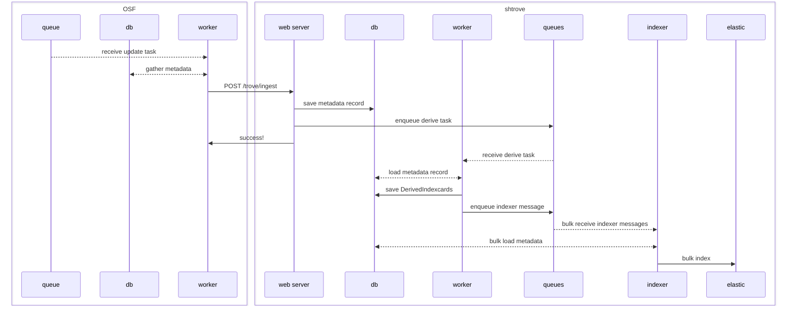

# how OSF metadata gets indexed for search (currently)

1. gather an OSFMAP metadata record (as [linked open data](https://en.wikipedia.org/wiki/Linked_open_data))
2. send that record to shtrove for ingestion
3. derive multiple representations/serializations
4. index by multiple indexing strategies in parallel

## 1. gather metadata
in `osf.metadata.osf_gathering`, each metadata property defined in OSF's metadata application
profile ([OSFMAP](https://osf.io/8yczr)) has a "gatherer" function that gets data from OSF's
database for the given item and yields values as portable/interoperable RDF linked data

(note: this is the same way that an OSF item's metadata is gathered when a user downloads
a metadata record or when sending an update to e.g. Datacite -- the RDF graph is an abstract
data structure than can be serialized/rendered in various ways)

after an update occurs to an item on OSF that is public and meant to be discoverable, 
background tasks (see OSF's `api.share.utils`) gather all available metadata and send
it to SHARE/trove

## 2. send to shtrove
metadata records are sent in [turtle](https://en.wikipedia.org/wiki/Turtle_RDF) format with
a POST request to shtrove's `/trove/ingest` api -- for details of query params, see
[how-to docs](https://github.com/CenterForOpenScience/SHARE/blob/develop/how-to/use-the-api.md#posting-index-cards)

in OSF, all descriptive metadata is sent in a "main" record, while administrative
metadata (specific to OSF usage, rather than describing the item itself) and,
in the near future, custom CEDAR metadata records are gathered and sent in separate 
"supplementary" records -- all these records are connected by the same `focus_iri`
(identifying the item in OSF) and the knowledge graphs they contain must each be a tree
rooted at that focus iri

requests are authenticated by a pre-created access token -- for historical reasons,
each OSF "preprint provider" and "registration provider" has a separate access token,
and OSF has an additional static token that is used both for creating provider tokens and
for indexing items that don't belong to a provider (e.g. projects)

based on request headers and query params, shtrove ensures in the database:
    * `share.Source`/`share.SourceConfig` for the authenticated user, with...
    * `share.SourceUniqueIdentifier` for given `record_identifier`, with...
    * `trove.ResourceIdentifier` for given `focus_iri`
(see `trove.digestive_tract.sniff`)

then shtrove parses the request body, and may create (or update) in the database:
    * `trove.ResourceIdentifier` (for each described resource and its types)
    * `trove.Indexcard` (with identifiers and type-identifiers for the focus resource)
    * "resource descriptions" in turtle format:
        * if non-supplementary, `trove.LatestResourceDescription` and `trove.ArchivedResourceDescription`
        * if supplementary, only `trove.SupplementaryResourceDescription`
(see `trove.digestive_tract.extract`)

shtrove then enqueues a background `task__derive` and responds to OSF with `201 CREATED` success

(note: from this point on, all background tasks are in SHARE's own queues and workers,
unaffected by OSF's chronic celery-task logjams)

## 3. derive representations
after an update has been received for an `Indexcard`, `trove.digestive_tract.task__derive`
combines that card's `LatestResourceDescription` and each current `SupplementaryResourceDescription`
and creates a `DerivedIndexcard` for each deriver in `trove.derive.DEFAULT_DERIVER_SET`

current derivers include:
    * "osfmap_json_mini": a [json-ld](https://en.wikipedia.org/wiki/JSON-LD) format using [OSFMAP](https://osf.io/8yczr) property keys, with some noisier properties (e.g. list of all files in a project) omitted -- this is the format expected by OSF's current search frontends
    * "sharev2_elastic": a json format for back-compat with 2016's [SHAREv2 search api](https://staging-share.osf.io/api/v2/search/creativeworks/_search), a raw pass-thru to elasticsearch
    * "oaidc_xml": a minimal xml format used in shtrove's [/oai-pmh/](https://staging-share.osf.io/oai-pmh/?verb=ListRecords&metadataPrefix=oai_dc) feed, following the [OAI Protocol for Metadata Harvesting](https://www.openarchives.org/OAI/openarchivesprotocol.html)

once all relevant `DerivedIndexcard`s are saved, `task__derive` enqueues messages
(using `share.search.index_messenger`) to notify shtrove's "indexer daemon" that the
given `Indexcard` is ready for indexing

## 4. index multiple ways
shtrove's indexer daemon (see `share.search.daemon`) is meant for efficient bulk-indexing
to multiple indexing strategies in parallel -- each index strategy has its own separate
message queues and daemon threads for urgent and nonurgent updates, where each thread fetches
a chunk of messages and streams updates to elasticsearch's bulk-index api (or according to logic
in the indexing strategy)

(note: on reflection, there's some logical redundancy between urgent/nonurgent queues and
update/backfill message types that shouldn't cause problems but could likely be simplified)

there are currently only two indexing strategies: "sharev2_elastic8" and "trovesearch_denorm"

the "sharev2_elastic8" strategy loads the sharev2_elastic `DerivedIndexcard` and puts the json
into an elasticsearch8 index as-is, to support the legacy sharev2 search (passthru to elasticsearch)

the "trovesearch_denorm" strategy loads and traverses the combined knowledge graph
(`LatestResourceDescription` and each `SupplementaryResourceDescription`) to populate two
elasticsearch8 indexes: one index that supports requests to `/trove/index-card-search` and
another index that supports `/trove/index-value-search`
(see [search api docs](https://staging-share.osf.io/trove/docs) for details of expected behavior)
-- allows indexing and querying on arbitrary graphs, including on metadata properties that
were not known ahead of time (e.g. from CEDAR template instances)

(note: this multi-strategy approach allows for experimenting and side-by-side comparison of
different implementations of the trove search api, which offers some complex functionality that
could be implemented a variety of ways -- if there were multiple trovesearch strategies
(as there was before settling on trovesearch_denorm), can select a non-default one with
the `indexStrategy` query param)

## OSF-to-shtrove ingestion sequence
(slightly simplified)

